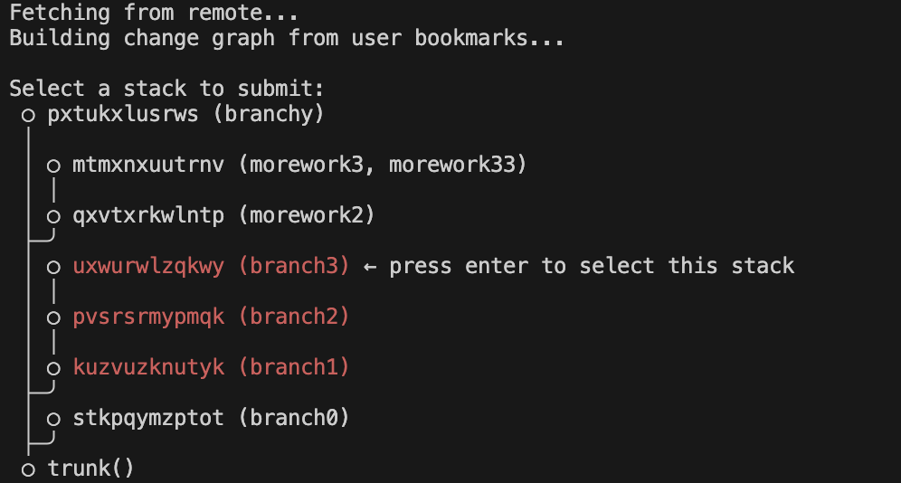

# jj-stack

A CLI tool for creating and managing stacked pull requests on GitHub when using Jujutsu locally.



> **Note:** The command can be run as either `jst` (recommended) or `jj-stack`. Examples below use `jst`.

## Setup

### Installation

Install jj-stack globally using npm:

```bash
npm install -g jj-stack
```

After installation, the `jst` and `jj-stack` commands will be available globally.

<details>
<summary> If you prefer to build from source instead of using npm </summary>

1. Clone the repository:

   ```bash
   git clone https://github.com/keanemind/jj-stack.git
   cd jj-stack
   ```

2. Install dependencies:

   ```bash
   npm install
   ```

3. Build the project:

   ```bash
   npm run build
   ```

4. Make the CLI available globally:

   ```bash
   npm link
   ```

   Or run directly with:

   ```bash
   node dist/index.js
   ```

</details>

### Authentication

Set up GitHub authentication:

jj-stack supports multiple authentication methods (in priority order):

**Option 1: GitHub CLI (Recommended) ⭐**

```bash
# Install GitHub CLI if not already installed
brew install gh  # macOS
# or visit https://cli.github.com/

# Authenticate with GitHub
gh auth login

# That's it! jj-stack will automatically use your GitHub CLI auth
```

**Option 2: Environment Variable**

```bash
export GITHUB_TOKEN="your_github_personal_access_token"
# or
export GH_TOKEN="your_github_personal_access_token"
```

**Creating a Personal Access Token:**

- Go to https://github.com/settings/tokens/new
- Required scopes: `repo` (includes pull request access)

**Test your authentication:**

```bash
jst auth test
```

For more details, see [AUTHENTICATION.md](./AUTHENTICATION.md)

## Usage

### Default Command

```bash
# Display the current bookmark stacks and change graph
jst
```

Running `jst` without any arguments will:

- Fetch from the remote repository
- Build a graph of your bookmarked changes
- Display an interactive visualization of stacked bookmarks
- Allow you to select a bookmark to submit directly from the graph

If no bookmarks are found, it will prompt you to create bookmarks first with `jj bookmark create [revision]`.

### Authentication Commands

```bash
# Test your current authentication setup
jst auth test

# Show authentication help
jst auth help
```

### Submit a bookmark as a PR

```bash
jst submit <bookmark-name> [--dry-run]
```

This command submits the specified bookmark and all bookmarks below it (downstack toward trunk) as pull requests.

#### Dry Run Mode

Use `--dry-run` to simulate the entire process without making any changes:

```bash
jst submit my-feature --dry-run
```

This will:

- ✅ Validate the bookmark exists locally
- ✅ Check for remote bookmarks
- ✅ Auto-detect GitHub repository (no token required)
- ✅ Determine base branch from stacking
- ✅ Generate PR content
- ✅ Show exactly what would be done
- ✅ Output detailed JSON for debugging

Perfect for development, testing, and understanding what the tool will do.

#### Normal Mode

```bash
export GITHUB_TOKEN="your_token"
jst submit my-feature
```

This command will:

1. **Check for remote bookmark**: Determine if the bookmark has already been pushed to the remote
2. **Auto-detect GitHub repository**: Extract owner/repo from your git remote URL
3. **Check for existing PR**: Look for an open PR for this bookmark
4. **Determine base branch**:
   - If the bookmark is stacked on another bookmark, use that as the base
   - Otherwise, use `main` as the base branch
5. **Generate PR content**: Use the bookmark's latest commit message for title
6. **Push bookmark**: Push the bookmark to the remote repository
7. **Create PR**: Create a new pull request on GitHub

### View bookmark stacks

```bash
# Display the current bookmark hierarchy and stacking relationships
jst
```

This is the default command that shows an interactive graph of your stacked bookmarks. You can navigate through the graph and select bookmarks to submit directly from the visualization.

## Requirements

- Node.js 18+
- Jujutsu (jj) version 0.30.0 or later
- Git repository with GitHub remote
- GitHub authentication (multiple methods supported)

## Environment Variables

- `GITHUB_TOKEN` or `GH_TOKEN` (optional): Your GitHub personal access token
- `GITHUB_OWNER` (optional): Override auto-detected repository owner
- `GITHUB_REPO` (optional): Override auto-detected repository name
- `JJ_PATH` (optional): Custom path to jj executable

## How it works

The tool leverages Jujutsu's bookmark system to understand the structure of your stacked changes. It:

1. Analyzes your local bookmarks using `jj bookmark list` and `jj log`
2. Builds a graph of how bookmarks are stacked on top of each other
3. Uses this information to create properly linked pull requests on GitHub
4. Sets the correct base branch for each PR based on the stacking relationship

## Example Workflow

```bash
# Create a stack of bookmarks
jj new main -m "Add user authentication"
jj bookmark create auth --revision @

jj new -m "Add user profile page"
jj bookmark create profile --revision @

jj new -m "Add profile editing"
jj bookmark create profile-edit --revision @

# Submit bookmarks downstack from the top
jst submit profile-edit  # Creates PRs: auth -> main, profile -> auth, profile-edit -> profile

# Or submit starting from any point in the stack
jst submit profile      # Creates PRs: auth -> main, profile -> auth
```
